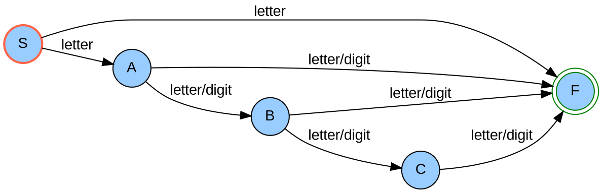
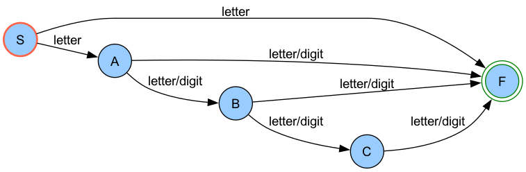

|Homework           | **1**                                 |
|:------------------|:--------------------------------------|
|Author             | **Mehdi Karami**                      |
|Student Number     | **4021110008**                        |
|Course             | **Compiler Design**                   |
|University         | **University of Science and Culture** |

# Task 1 - The pseudo-code to find the `nth` term of the Fibonacci sequence:

### Imperative method (iteration)

```julia
function fibonacciImperative(number):
    # Base cases
    if number <= 1:
        return number
    else:
        # Initialize Fibonacci sequence
        fib = [0, 1]
        # Generate Fibonacci sequence up to nth term
        for i from 2 to number:
            fib[i] = fib[i-1] + fib[i-2]
        # Return nth term
        return fib[number]
```

### Declarative method (recursion)

```julia
function fibonacciDeclarative(number):
    # Base cases
    if number <= 1:
        return number
    else:
        # Recursively calculate nth term
        return fibonacciDeclarative(number-1) + fibonacciDeclarative(number-2)
```

# Task 2 - Output of the lexical analyzer

Input string:

``` julia
if else25>40.5 a_1 = 1; else _a = 2;
```

Tokenized output with error handling:

1. Token: `if` (R1)
2. Token: `else` (R1)
3. Error: `25` does not match any token, enter panic mode.
4. Error: `>` does not match any token, enter panic mode.
5. Error: `40.5` does not match any token, enter panic mode.
6. Token: `a_1` (R4)
7. Token: `=` (R3)
8. Token: `1` (R2)
9. Token: `;` (R5)
10. Token: `else` (R1)
11. Error: `_a` does not match any token, enter panic mode.
12. Token: `=` (R3)
13. Token: `2` (R2)
14. Token: `;` (R5)

The output of the lexical analyzer, with error handling using panic mode, would be:

```julia
Token: if
Token: else
Error: Unrecognized token '25' at position X
Error: Unrecognized token '>' at position Y
Error: Unrecognized token '40.5' at position Z
Token: a_1
Token: =
Token: 1
Token: ;
Token: else
Error: Unrecognized token '_a' at position W
Token: =
Token: 2
Token: ;
```

# Task 3 - Draw a Deterministic Finite Automaton for the token

We used `Graphize` to present the Deterministic Finite Automaton (DFA) as the DOT code.



Output:



To install Graphviz and generate the output from the provided DOT code, follow these steps:

### 1. Install Graphviz
- **Windows**
    - Download the Graphviz installer from the [Graphviz website](https://graphviz.org/download/).
    - Follow the installation instructions provided in the installer.

- **MacOS**
    You can use `Homebrew` to install Graphviz. Open Terminal and run:

    ```bash
    brew install graphviz
    ```

- **Linux(Ubuntu/Debian)**
    Open Terminal and run:

    ```bash
    sudo apt-get update
    sudo apt-get install graphviz
    ```

### 2. Add the file with a `.dot` extension, 
for example: **dfa.dot**

### 3. Generate the output:
   - Open a terminal or command prompt.
   - Navigate to the directory where you saved the DOT file.
   - Run the following command:
     ```bash
     dot -Tpng dfa.dot -o dfa.png
     ```
     This command generates a PNG image named `dfa.png` based on the DOT file `dfa.dot`.
     You can find the generated image (`dfa.png`) in the same directory where you saved the DOT file.

# Task 4 - Write a regular expression

The regular expression can be represented as follows:

```scss
(0)* 1 (00)* 0 1 (0)*
```
Explanation:

(0)*: Matches zero or more occurrences of '0'.
1: Matches the First '1'.
(00)*: Matches zero or more occurrences of '00'.
0: Make the sequence odd.
1: Matches the Last '1'.
(0)*: Matches zero or more occurrences of '0'.

Sample Test Using Python:
```py
import re

# Define the regex pattern
pattern = r'(0)*1(00)*01(0)*'

# Test strings
test_strings = [
    "1001",
    "101",
    "11",
    "111",
    "10000010",
    "00100010",
    "100001"
]

# Iterate through test strings
for test_str in test_strings:
    if re.match(pattern, test_str):
        print(f"'{test_str}' matches the pattern.")
    else:
        print(f"'{test_str}' does not match the pattern.")
```

Output:
```julia
'1001' does not match the pattern.
'101' matches the pattern.
'11' does not match the pattern.
'111' does not match the pattern.
'10000010' matches the pattern.
'00100010' matches the pattern.
'100001' does not match the pattern.
```
