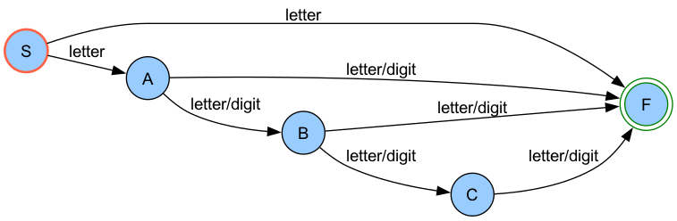

# 📘 Today I Learned

This repo is a collection of *bite-sized learnings*, *quick tips*, and *interesting tidbits* that I've picked up each day. 

From **coding snippets** to **life hacks**, you'll find a variety of topics here.

As I continue this eclectic exploration, I stay tuned for more discoveries 🤯

&nbsp;&nbsp;

**- Protocol-Oriented Programming**

&nbsp;&nbsp;

**- Unused Code Finder in Swift Projects (Xcode)**

**- Compiler Design ( -> DNF ) Using Graphize**

&nbsp;&nbsp;

&nbsp;&nbsp;

**- Quantum Computing**

&nbsp;&nbsp;

**- Web Design ([Bootstrap](WebDesign/University/LuxoPSDE-MailTemplate/index.html))**

  

